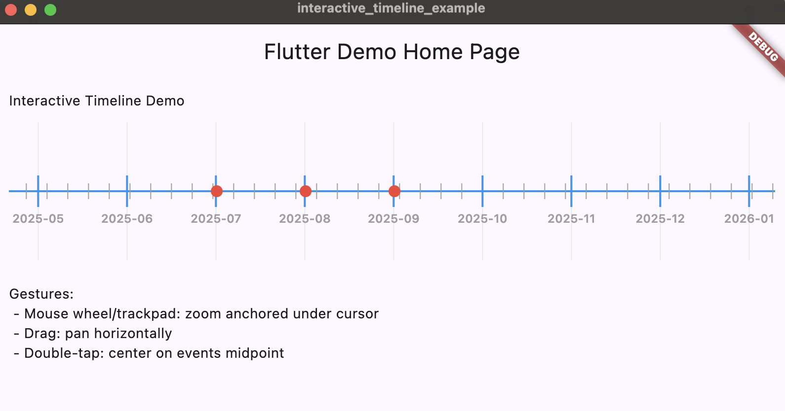

# interactive_timeline

A performant, reusable horizontal timeline widget for Flutter with:

- Anchored zoom (mouse wheel, trackpad, Magic Mouse, pinch) around the cursor/focal point
- Smooth horizontal panning
- Auto-LOD ticks (hours → months → years → decades → centuries → millennia)
- Double-tap to center on events midpoint (or initial center)
- Event markers with tap callback and customizable widget/shape
- Parent scroll suppression (prevents ancestor scrollables from hijacking gestures)
- Optional fisheye lens magnification under the cursor (macOS dock style)
  - Configurable color and optional glow highlighting under the lens

[](https://pub.dev/packages/interactive_timeline)
Published on [pub.dev](https://pub.dev/packages/interactive_timeline).

### Screenshot



### Installation (from pub.dev)

Add to your app's `pubspec.yaml`:

```yaml
dependencies:
  interactive_timeline: ^0.2.1
```

### Installation (local path in a monorepo)

Add a path dependency in your app's `pubspec.yaml`:

```yaml
dependencies:
  interactive_timeline:
    path: packages/interactive_timeline
```

Import it:

```dart
import 'package:interactive_timeline/interactive_timeline.dart';
```

### Quick start

```dart
final now = DateTime.now().toUtc();
final events = <TimelineEvent>[
  TimelineEvent(date: now.subtract(const Duration(days: 365 * 2)), title: 'Two years ago'),
  TimelineEvent(date: now.subtract(const Duration(days: 30)), title: 'Last month'),
  TimelineEvent(date: now, title: 'Today'),
  TimelineEvent(date: now.add(const Duration(days: 30)), title: 'Next month'),
  TimelineEvent(date: now.add(const Duration(days: 365)), title: 'Next year'),
];

SizedBox(
  height: 140,
  child: TimelineWidget(
    height: 120,
    events: events,
    minZoomLOD: TimeScaleLOD.month,
    maxZoomLOD: TimeScaleLOD.century,
    tickLabelColor: const Color(0xFF444444),
    axisThickness: 2,
    majorTickThickness: 2,
    minorTickThickness: 1,
    minorTickColor: Colors.grey,
    labelStride: 1,
    labelStyleByLOD: const {
      TimeScaleLOD.year: TextStyle(fontSize: 12, fontWeight: FontWeight.w600),
      TimeScaleLOD.decade: TextStyle(fontSize: 12),
    },
    onZoomChanged: (z) => debugPrint('zoom: $z'),
    onEventTap: (e) => debugPrint('Tapped: ${e.title}'),
  ),
)
```

### API (selected)

- Data: `events` (`TimelineEvent`)
- Size: `height`
- Zoom/scale: `initialZoom`, `minZoom`, `maxZoom`, `minZoomLOD`, `maxZoomLOD`, `basePixelsPerMillisecond`
- Styling: `timelineColor`, `eventColor`, `backgroundColor`, `tickLabelColor`, `axisThickness`, `majorTickThickness`, `minorTickThickness`, `minorTickColor`, `labelStride`, `labelStyleByLOD`, `tickLabelStyle`, `tickLabelFontFamily`
- Callbacks: `onZoomChanged(double)`, `onEventTap(TimelineEvent)`
- Behavior: anchored zoom, double-tap to center, suppress ancestor pointer events

#### Fisheye lens (optional)

Enable a dock-like magnification around the pointer along the main axis. Events, tick positions, and optionally tick heights and label font sizes grow smoothly near the cursor. Includes hover/long‑press activation, smoothing, and subtle visuals.

```dart
TimelineWidget(
  enableFisheye: true,
  // Max scale at the cursor (>= 1.0)
  fisheyeIntensity: 1.8,
  // Pixel radius along the main axis affected by the lens
  fisheyeRadiusPx: 140,
  // Falloff sharpness (>= 1.0). Higher = sharper edge
  fisheyeHardness: 2.0,
  // What to scale
  fisheyeScaleTicks: true,    // tick height grows near cursor
  fisheyeScaleMarkers: true,  // event markers grow near cursor
  fisheyeScaleLabels: true,   // tick label font size grows near cursor
  // UX
  fisheyeEnterMs: 140,
  fisheyeExitMs: 160,
  fisheyeFollowAlpha: 0.25,          // smoothing per ~frame
  fisheyeActivateOnHover: true,
  fisheyeActivateOnLongPress: true,
  fisheyeShowIndicator: true,        // vertical line under the lens
  fisheyeEdgeFeatherOpacity: 0.12,   // subtle band at radius
  // Visual customization
  fisheyeColor: Colors.deepPurple,       // indicator + feather color (optional)
  fisheyeGlowEnabled: true,              // retro glow that illuminates the grid
  fisheyeGlowColor: Colors.deepPurple,   // glow color (optional)
  fisheyeGlowOpacity: 0.06,
  fisheyeGlowRadiusMultiplier: 0.4,      // reach beyond radius (0..3)
  fisheyeGlowBlurSigma: 14.0,            // softness
  // Compositing
  fisheyeBlendMode: BlendMode.plus,      // lens indicator + feather
  fisheyeGlowBlendMode: BlendMode.screen // glow blending
)
```

Notes:
- Works in both orientations. The lens follows the pointer along the main axis.
- Hit testing respects marker scaling. Labels/ticks are re-positioned under the warp; tick labels can also scale if enabled.
- Lens activation is animated (enter/exit); the center follows the pointer smoothly.

#### Event markers

- Per-event overrides on `TimelineEvent`: `markerOffset`, `markerScale`.
- Defaults on `TimelineWidget`: `eventMarkerOffset`, `eventMarkerScale`.
- Custom marker as widget:

```dart
TimelineWidget(
  events: events,
  showDefaultEventMarker: false,
  eventMarkerOffset: const Offset(0, -12),
  eventMarkerScale: 1.0,
  eventMarkerBuilder: (context, event, info) {
    return DecoratedBox(
      decoration: BoxDecoration(
        color: Colors.red,
        borderRadius: BorderRadius.circular(8),
      ),
      child: Padding(
        padding: const EdgeInsets.symmetric(horizontal: 6, vertical: 3),
        child: Text(event.title, style: const TextStyle(color: Colors.white, fontSize: 10)),
      ),
    );
  },
  onEventTap: (e) => debugPrint('Tap ${e.title}'),
)
```

- Custom marker as shape (canvas painter):

```dart
TimelineWidget(
  events: events,
  eventMarkerPainter: (canvas, event, info) {
    final p = Paint()..color = Colors.purple;
    canvas.drawRRect(
      RRect.fromRectAndRadius(
        Rect.fromCenter(center: info.position, width: 12 * info.markerScale, height: 12 * info.markerScale),
        const Radius.circular(3),
      ),
      p,
    );
  },
)
```

#### Ticks

- Custom tick painter and transforms:

```dart
TimelineWidget(
  tickOffset: const Offset(0, 0),
  tickScale: 1.0,
  tickPainter: (canvas, tick, ctx) {
    final paint = Paint()
      ..color = tick.isMajor ? ctx.axisColor : ctx.minorColor
      ..strokeWidth = tick.isMajor ? 2 : 1;
    if (!tick.vertical) {
      final h = tick.height * ctx.tickScale;
      final x = tick.positionMainAxis + ctx.tickOffset.dx;
      final y = tick.centerCrossAxis + ctx.tickOffset.dy;
      canvas.drawLine(Offset(x, y - h), Offset(x, y + h), paint);
    } else {
      final h = tick.height * ctx.tickScale;
      final x = tick.centerCrossAxis + ctx.tickOffset.dx;
      final y = tick.positionMainAxis + ctx.tickOffset.dy;
      canvas.drawLine(Offset(x - h, y), Offset(x + h, y), paint);
    }
  },
  tickLabelStyle: const TextStyle(fontSize: 11),
  tickLabelFontFamily: 'monospace',
)
```

### Example app (in this repo)

An example is included at `packages/interactive_timeline/example`. Run it directly:

```bash
cd example
flutter run
```

The example demonstrates:

- Anchored zoom via wheel/trackpad/pinch
- Horizontal panning
- Double-tap to center on events midpoint
- Event tap callback (shows a SnackBar)

### Publish to pub.dev

1. Ensure `pubspec.yaml` has `name`, `description`, `version`, `homepage`, `repository`, `issue_tracker` and a proper SDK/Flutter constraint.
2. Include a `LICENSE` and `CHANGELOG.md` (both are present in this repo).
3. Add screenshots/GIFs to your README (optional but recommended).
4. Run:
   ```bash
   flutter pub publish --dry-run
   ```
   Fix any issues it reports.
5. Publish:
   ```bash
   flutter pub publish
   ```
6. Consumers can depend on it with:
   ```yaml
   dependencies:
     interactive_timeline: ^0.2.1
   ```

### Notes

- Anchored zoom keeps content under pointer fixed while zooming
- Pooled tick manager for performance
- Deep-time beyond `DateTime` possible with a custom epoch in future

---

## Contributing

- Fork the repo and create a feature branch from `main`.
- Development setup:
  - Flutter SDK 3.22+ (Dart 3)
  - Format and analyze before committing:
    - `dart format .`
    - `flutter analyze`
  - Run tests (add more as you contribute):
    - `flutter test`
  - Example app for manual testing:
    - `cd example && flutter run`
- Coding style: keep code clear and well-named; prefer small, readable functions. Follow the included `flutter_lints` rules.
- Commits: conventional messages are appreciated (feat:, fix:, docs:, chore:, refactor:, test:).
- Pull Requests: include a brief description, screenshots/GIFs if UI changes, and a changelog entry suggestion.

## Releasing and Publishing (pub.dev)

1. Update `CHANGELOG.md` with a new entry.
2. Bump `version:` in `pubspec.yaml` (semver).
3. Verify `README.md`, `LICENSE`, and `pubspec.yaml` metadata (`homepage`, `repository`, `issue_tracker`, `topics`).
4. Ensure screenshots referenced in the README (e.g., `demo1.png`) are checked in.
5. Dry run:
   ```bash
   dart format .
   flutter pub get
   flutter pub publish --dry-run
   ```
6. If clean, publish:
   ```bash
   flutter pub publish
   ```
7. Tag the release (optional but recommended):
   ```bash
   git tag v<version>
   git push --tags
   ```

## Republishing / Hotfixes

pub.dev does not allow re-uploading the same version. For any fix, bump the version (usually patch):

1. Update `CHANGELOG.md` (e.g., “0.1.1 – Fix label style precedence”).
2. Bump `version:` in `pubspec.yaml` to the next patch/minor.
3. Re-run the publish steps above (dry-run, then publish).
4. If you accidentally published a broken version, you can retract it from the pub.dev UI (Manage Versions → Retract). Consumers on that exact version will be warned.

### GitHub Pages website

- A minimal site is available under `docs/` and can be enabled via GitHub Pages (branch: `main`, folder: `/docs`).
- After it’s live, consider setting `homepage:` in `pubspec.yaml` to the Pages URL.
- If you prefer, move `demo1.png` into `docs/` (e.g., `docs/assets/`) and update links accordingly. Keeping it at the repo root also works for pub.dev README rendering.

## TODO ideas
### High‑impact UX improvements

#### Snapping and guidance
- Snap to ticks and/or nearest event with adjustable magnet strength and hysteresis.
- “Now” indicator + “Jump to Today” button; optional auto-follow when near “now”.

#### Navigation and controls
- Keyboard shortcuts: arrows (pan), +/- (zoom), Home/End (range), Enter (center on selection).
- Inertia/fling and springy edge clamping for pan; configurable friction/overscroll.
- Smooth animated zoom/pan helpers: animateToTime, animateZoomTo, fitRange.

#### Lens (fisheye) UX
- Lens fade/scale animation on enter/exit, with motion smoothing so it trails the pointer slightly.
- Edge feathering (fade at radius edge) and minimal lens indicator line under cursor.
- Touch behavior: long‑press to summon lens, dismiss on lift; toggle param to disable on mobile.

#### Readability and label quality
- Collision‑aware labels: skip/ellipsize/alternate baselines, or stagger major/minor label rows.
- Auto angle minor labels slightly at tight densities; text halo for contrast.
- Adaptive tick density targeting “min px per label” to avoid clutter.

#### Event interaction
- Hover tooltips/popovers with title, date, and description; configurable delay.
- Selection state with focus ring and keyboard navigation across events.
- Overlap resolution: subtle vertical jitter/stacking to avoid event collisions at the axis.
- Low‑zoom clustering (“+12 events”), expand on tap/zoom-in; optional mini‑timeline in tooltip.
- Brush/range selection to highlight and pass a time window to consumers.

#### Context and overview
- Overview/minimap (small bar) showing the full range with the current viewport window.
- Bookmarks: programmatic and user-defined anchors with quick-jump controls.

#### Accessibility
- Semantics for events and ticks; larger tap targets; high-contrast friendly defaults.
- Screen reader flow: announce focused event and time; rotor-like navigation by unit (hour/day/year).

#### Internationalization
- Locale-aware formats (Intl hook), time zones, ISO-week options, RTL support.

#### Theming
- Design tokens: axis/label/marker colors, elevations, shadows; dark/high-contrast presets.
- Motion preferences (respect “reduce motion”): disable animations or use gentle durations.

#### Performance polish
- RepaintBoundary for widget markers; layer caching for grid/axis; text painter cache already used.
- Debounce hover-driven repaints; limit tick generation to on-screen + small margin.
- Optional event virtualization when rendering widget-heavy markers.

### API additions to enable the above
#### Snapping/behavior
- snapBehavior: {toTicks, toEvents, strength, hysteresisPx}
- scrollPhysics: {inertia, friction, overscrollSpring}

#### Animation helpers
- animateToTime(DateTime, {duration, curve})
- animateZoomTo(double, {anchorPx, duration, curve})
- fitRange(DateTime start, DateTime end, {paddingPx})
- onViewportChanged(Viewport v) with time range and px bounds.

#### Lens configuration
- lensBehavior: {showOnHover, showOnLongPress, enterMs, exitMs, followSmoothing, edgeFeather}
#### Label/tick customization
- tickFormatter(TimeScaleLOD, DateTime) → String
- labelCollisionStrategy: {skip, ellipsize, stagger, angle}
- minLabelSpacingPx, maxLabelAngleDeg
#### Event UX
- eventTooltipBuilder, tooltipDelayMs
- onSelectionChanged(TimelineSelection)
- clusterThresholdPx, clusterRenderer

### Documentation/demo improvements
- Add a “UX Features” section with toggles for snapping, lens animations, tooltips, clustering.
- Include keyboard shortcuts overlay in the example.
- DartPad/Storybook-style demos showing each behavior preset (Dense, Reading, Dock Lens, Accessibility).
- Snap-to and keyboard navigation improve control and discoverability.
- Lens animations/feathering make the magnification feel natural.
- Collision-aware labels and tooltips improve readability without clutter.